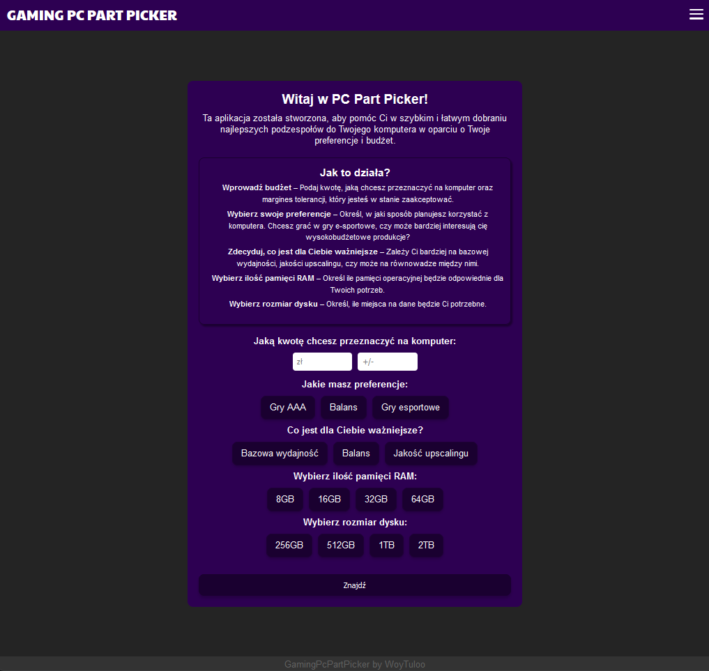
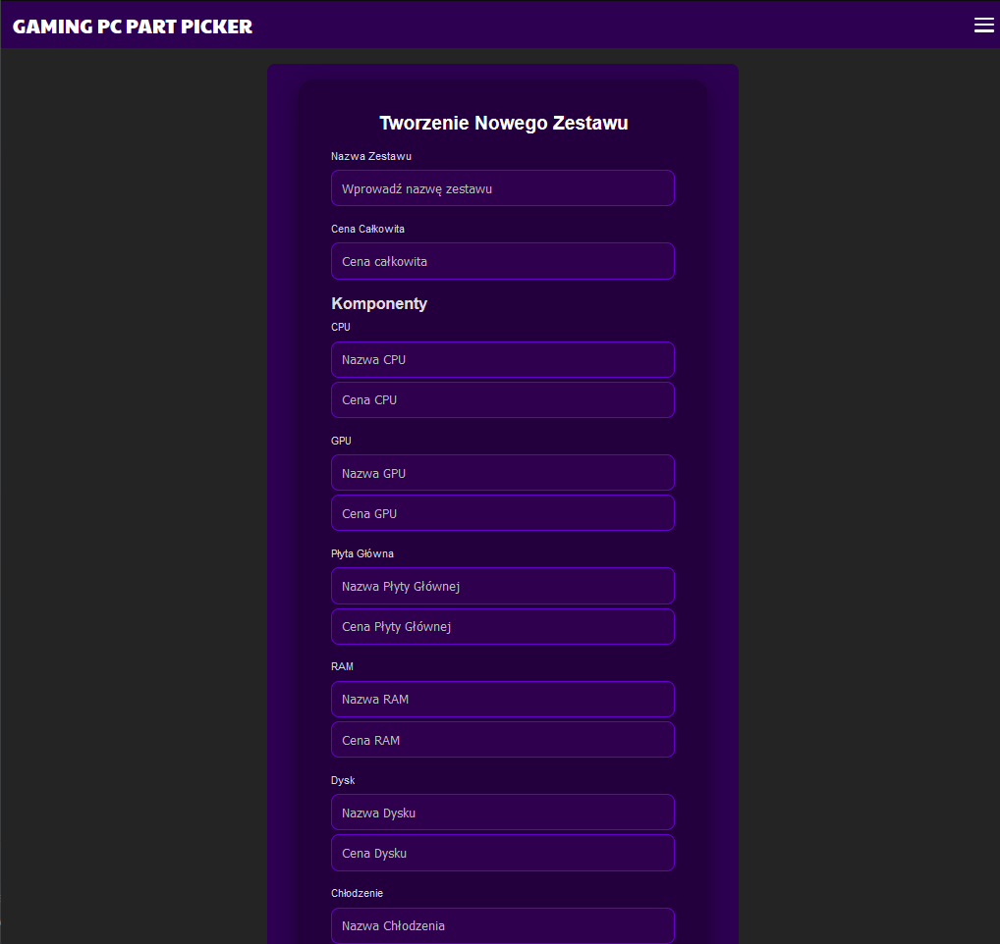
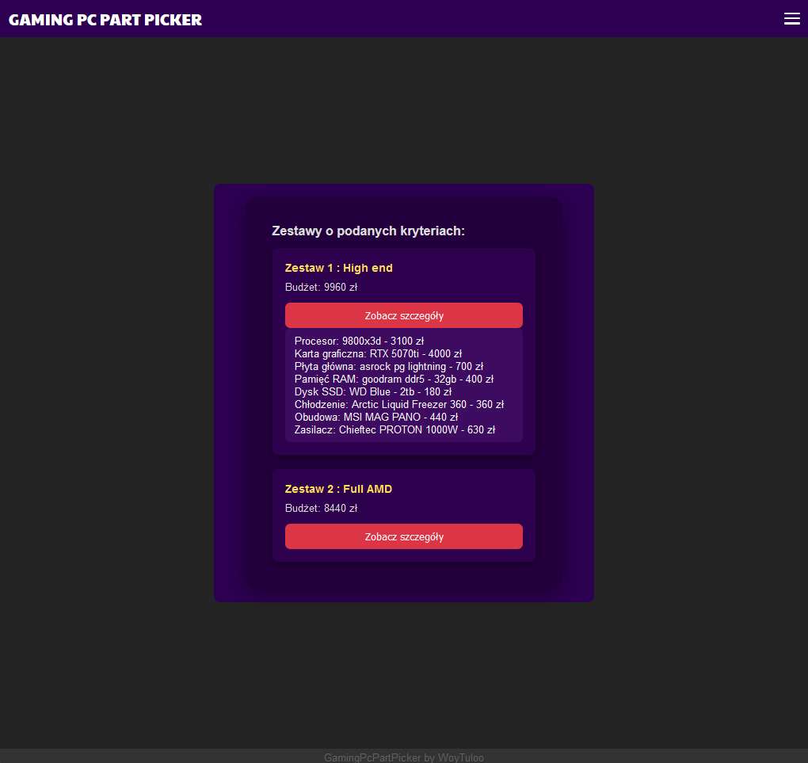
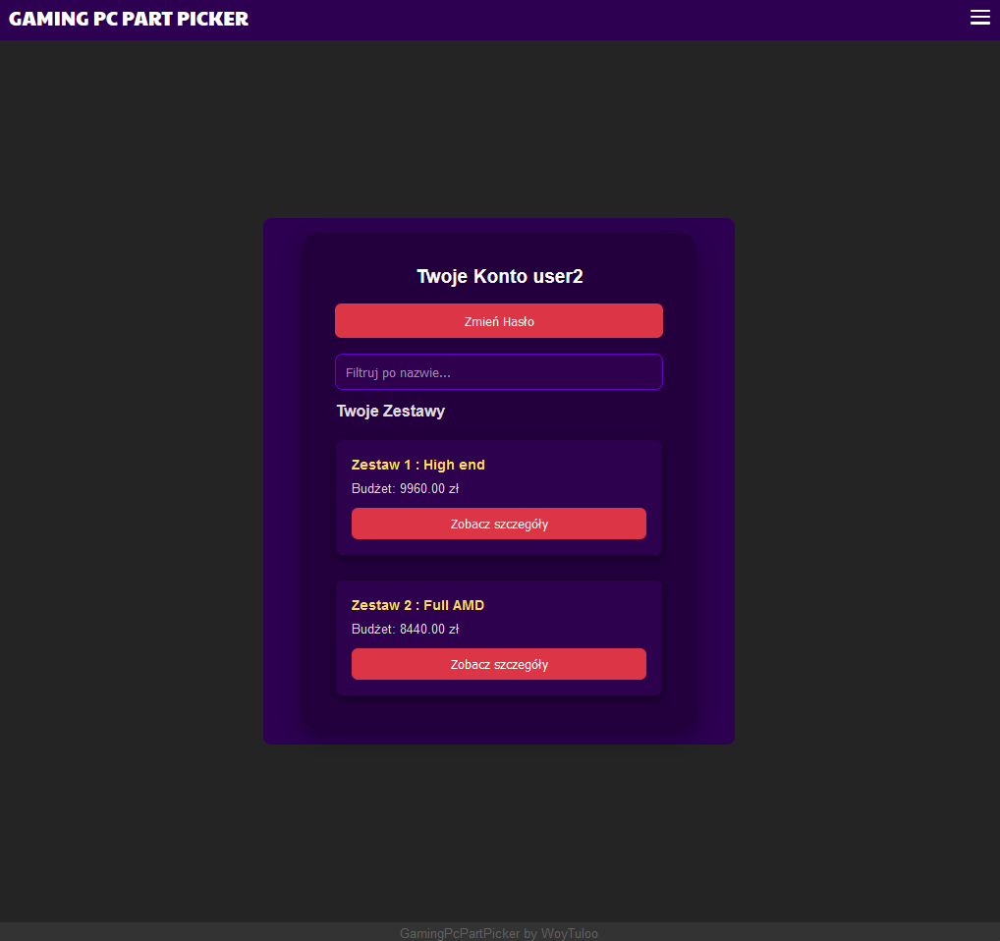
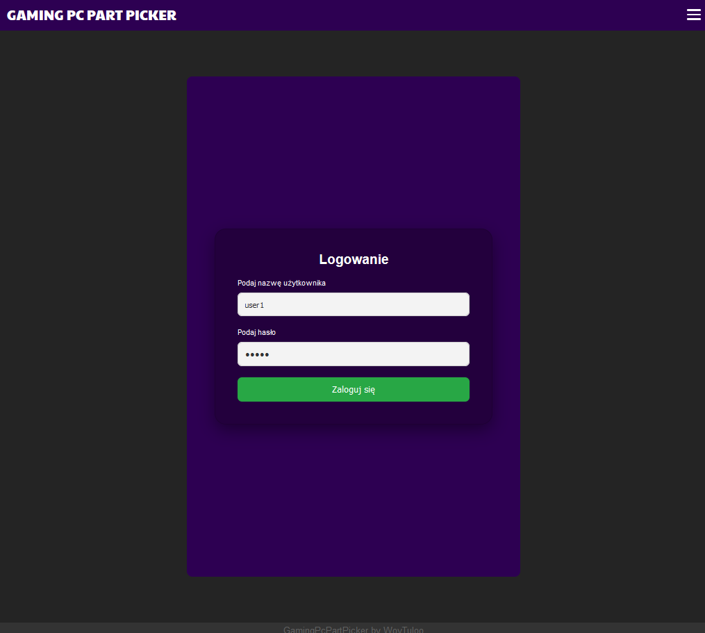

# GamingPcPartPicker

GamingPcPartPicker is a web application designed for PC enthusiasts to create, manage, and share custom computer component configurations. The platform simplifies the process of selecting compatible parts, provides filtering options, and fosters a community where users can exchange ideas for best  computer builds.

## Table of Contents

- [Features](#features)
- [Technologies Used](#technologies-used)
- [Installation](#installation)
- [Usage](#usage)
- [Showcase](#showcase)
- [Gallery](#gallery)

## Features

- **User Authentication**
  - Registration and login with secure password hashing.
  - Password reset functionality.
- **Component Management**
  - Add, edit, and delete custom PC component sets.
- **Advanced Search and Filtering**
  - Filter component sets based on price, specifications, and user preferences.
- **Admin Panel**
  - Manage user accounts and roles.
- **Security**
  - Protection against SQL Injection and XSS attacks using PDO.
  - Secure session management.
- **Responsive Design**
  - Accessible on desktops, tablets, and smartphones.

## Technologies Used

- **Frontend:**
  - HTML5, CSS3, JavaScript
  - Responsive Design
- **Backend:**
  - PHP 8.x
  - PostgreSQL
- **Server:**
  - Nginx
- **Containerization:**
  - Docker
- **Security:**
  - PHP Data Objects (PDO) for database interactions
  - Bcrypt for password hashing
- **Tools:**
  - Docker Compose
  - Git for version control

## Installation

### Prerequisites

- Docker
- Docker Compose
- Git

### Steps

1. **Clone the Repository:**

2. **Build and Run Containers:**
    
   - Navigate to the projects main directory:

          docker compose up -d --build

3. **Setup database:**

  -  Log into database:

              User: dev_user
              Password: dev_password
  -   Open console ***for dev_db*** database (if not exists then create one).
  -   Paste and execute the content of db_setup.sql file in the console.
  -   **(Optional)** Populate database for testing - paste and execute the content of populate_db.sql file in the console.

  -   Open your browser and navigate to:

          http://localhost:8080

## Usage

    Register an Account:
        Click on the "Register" button.
        Fill in your details and submit the form.

    Log In:
        Enter your credentials on the login page.
        Access your dashboard upon successful authentication.

    Manage Component Sets:
        Create new PC builds by adding components.
        Edit or delete your existing builds as needed.

    Interact with the Community:
        Browse and search for other users' component sets.

    Admin Functions:
        Administrators can manage user roles through the admin panel.
---

### Testing

For showcase purposes there were 3 users created:

            User:       admin
            Password:   admin

            User:       user1
            Password:   user1

            User:       user2
            Password:   user2

Use them to browse and test the functionalities of this app.

Enjoy !

### Gallery

    
